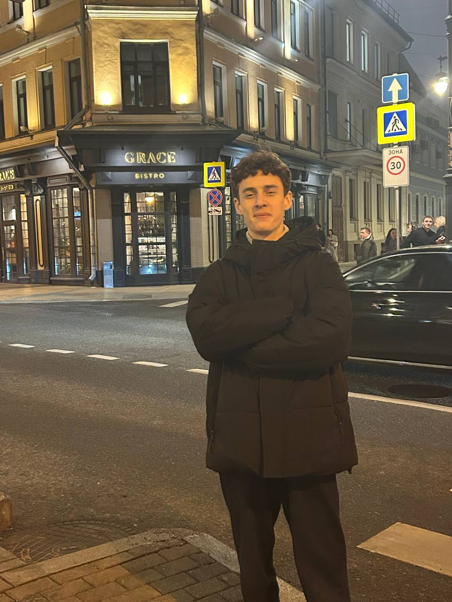
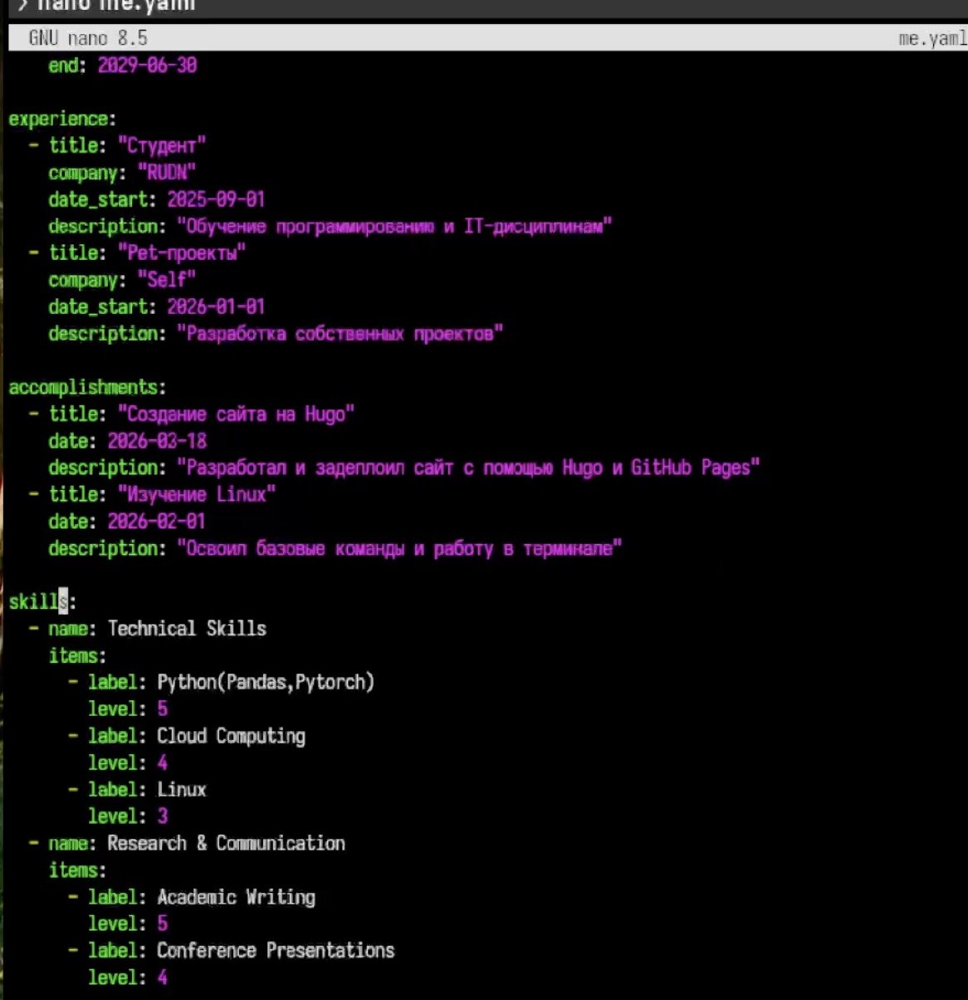
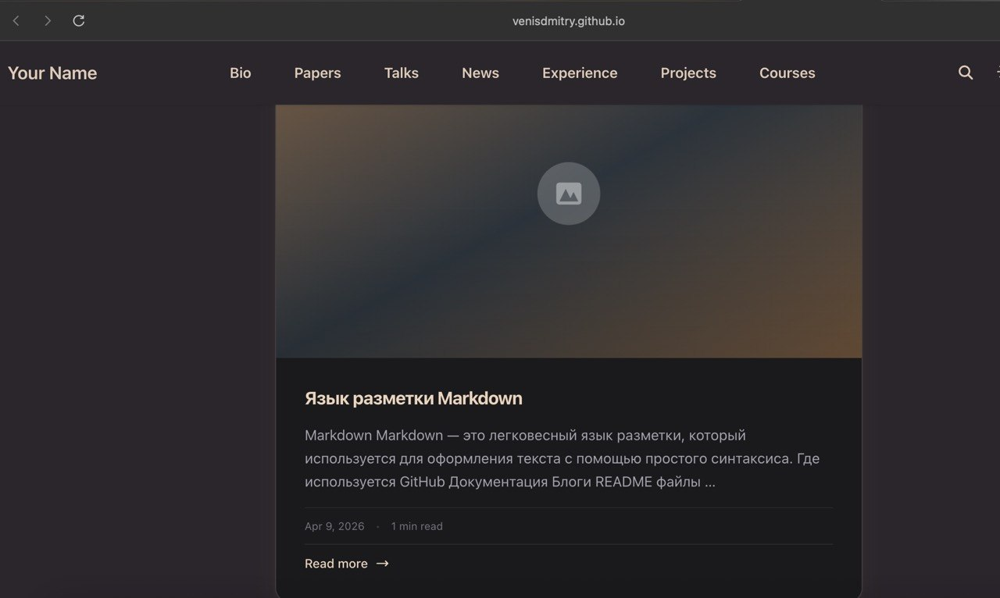
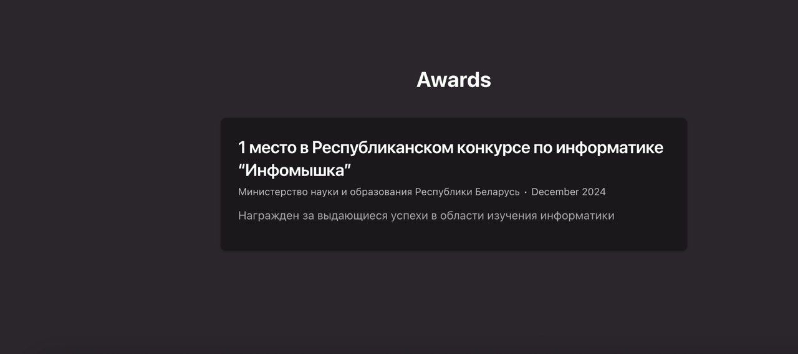

---
## Author
author:
  name: Венис Дмитрий
  email: 1032253513@rudn.ru
  affiliation:
    - name: Российский университет дружбы народов
      country: Российская Федерация
      postal-code: 117198
      city: Москва
      address: ул. Миклухо-Маклая, д. 6
## Title
title: Индивидуальный проект 3 этап
subtitle: Архитектура компьютера и операционные системы
license: CC BY
date: today
date-format: "YYYY-MM-DD" # Example: 2025-09-06
lang: ru
format:
  beamer:
    pdf-engine: xelatex
    theme: Madrid
    colortheme: dolphin
    aspectratio: 169
  revealjs:
    theme: simple
    slide-number: true
mainfont: "Liberation Serif"
sansfont: "Liberation Sans"
monofont: "Liberation Mono"
---

# Информация

## Докладчик

:::::::::::::: {.columns align=center}
::: {.column width="70%"}

  * Венис Дмитрий
  * студент НКАбд-01-25
  * Российский университет дружбы народов им. П. Лумумбы
  * [1032253513@rudn.ru](mailto:1032253513@rudn.ru)
  * <https://github.com/VenisDmitry>

:::
::: {.column width="30%"}

:::
::::::::::::::

    
---

# Цель работы

Продолжить работу с сайтом, добавить личные достижения

---

# Задание

1. Добавить информацию о навыках (Skills).
2. Добавить информацию об опыте (Experience).
3. Добавить информацию о достижениях (Accomplishments).
4. Сделать пост по прошедшей неделе.
5. Добавить пост на тему по выбору: Легковесные языки разметки. Языки разметки. LaTeX. Язык разметки Markdown.

---

# Выполнение индивидуального проекта

---

Добавляю навыки и достижения (рис. -@fig:001)

{#fig:001 width=70%}

---

Проверяю отображение двух новых постов на сайте. (рис. -@fig:002)

{#fig:002 width=70%}

---

Проверяю отображение своих достижений на сайте. (рис. -@fig:003)

{#fig:003 width=70%}

---

# Выводы

Мы продолжили работу с сайтом, добавили личные достижения.

